# CakeDayy

[](https://github.com/GRajKumar2512/CakeDayy/actions/workflows/ci.yml)
[](LICENSE)
[](https://kotlinlang.org)
[](app/build.gradle.kts)

An offline-first Android app that tracks birthdays, sorts who's coming up next, and reminds you ahead of time — built as a portfolio piece demonstrating multi-module Clean Architecture, MVVM, and modern Jetpack tooling.

---

## Screenshots

> _Placeholder — add screenshots or a short GIF here (e.g. upcoming list, add/edit person, groups, settings, the home-screen widget)._

| Upcoming list | Add / edit person | Widget |
|---|---|---|
| _screenshot_ | _screenshot_ | _screenshot_ |

---

## Tech stack

| Layer | Choice |
|---|---|
| Language | Kotlin 2.2, Coroutines + Flow |
| UI | Jetpack Compose, Material 3 |
| DI | Hilt |
| Persistence | Room (KSP), DataStore (Preferences) |
| Background work | WorkManager |
| Widget | Jetpack Glance |
| Serialization | kotlinx.serialization |
| Build | Gradle Kotlin DSL, version catalog (`gradle/libs.versions.toml`), `build-logic/` convention plugins |
| Static analysis | Android Lint, Detekt (zero-tolerance, `maxIssues: 0`) |
| Testing | JUnit4, Turbine, Robolectric, Compose UI testing |

`minSdk 26` / `compileSdk 37` / `targetSdk 36`.

---

## Architecture

Multi-module Clean Architecture with MVVM as the presentation pattern, and a strict inward dependency rule:

```
presentation (Compose + ViewModel)  ──▶  domain (pure Kotlin)  ◀──  data (Room, DataStore)
```

`domain` owns models, use cases, and repository *interfaces* only — no Android/Room/Compose imports. `data` implements those interfaces. `presentation` depends on `domain` only; it never reaches into Room or DataStore. Features never depend on each other — cross-feature needs go through `domain`. `:app` is the sole composition root: it's the only module that wires `data` implementations to `domain` interfaces via Hilt.

The diagram below is generated directly from the Gradle module dependencies (`settings.gradle.kts` + each module's `build.gradle.kts`), not from prose:

```mermaid
graph TD
    subgraph Presentation
        app[":app"]
        featurePeople[":feature:people"]
        featureEditPerson[":feature:editperson"]
        featureGroups[":feature:groups"]
        featureSettings[":feature:settings"]
        widget[":widget"]
    end

    subgraph Domain
        coreDomain[":core:domain"]
    end

    subgraph Data
        coreData[":core:data"]
        coreDatabase[":core:database"]
        coreDatastore[":core:datastore"]
        coreNotifications[":core:notifications"]
    end

    subgraph Foundation
        coreModel[":core:model"]
        coreCommon[":core:common"]
        coreDesignsystem[":core:designsystem"]
        coreUi[":core:ui"]
        coreTesting[":core:testing"]
    end

    app --> coreDomain
    app --> coreData
    app --> coreDesignsystem
    app --> coreNotifications
    app --> featurePeople
    app --> featureEditPerson
    app --> featureGroups
    app --> featureSettings
    app --> widget

    featurePeople --> coreDomain
    featurePeople --> coreDesignsystem
    featurePeople --> coreUi
    featurePeople --> coreCommon
    featureEditPerson --> coreDomain
    featureEditPerson --> coreDesignsystem
    featureEditPerson --> coreUi
    featureEditPerson --> coreCommon
    featureGroups --> coreDomain
    featureGroups --> coreDesignsystem
    featureGroups --> coreUi
    featureGroups --> coreCommon
    featureSettings --> coreDomain
    featureSettings --> coreDesignsystem
    featureSettings --> coreUi
    featureSettings --> coreCommon
    widget --> coreDomain
    widget --> coreDesignsystem

    coreData --> coreDomain
    coreData --> coreDatabase
    coreData --> coreDatastore
    coreData --> coreCommon
    coreData --> coreModel
    coreDatabase --> coreModel
    coreDatabase --> coreCommon
    coreDatastore --> coreModel
    coreDatastore --> coreCommon
    coreNotifications --> coreDomain
    coreNotifications --> coreCommon

    coreDomain --> coreModel
    coreDomain --> coreCommon
    coreUi --> coreDesignsystem
    coreUi --> coreModel
    coreTesting --> coreDomain
```



`:core:testing`'s fakes (`FakePersonRepository`, `FakeGroupRepository`, …) implement `:core:domain` interfaces directly, so it only depends on `domain` — not `data` — keeping test doubles decoupled from the persistence layer they're standing in for.

### Module responsibilities

| Module | Responsibility |
|---|---|
| `:app` | DI root, navigation host, `Application`, widget + worker registration — the only place wiring happens. |
| `:core:model` | Pure Kotlin domain models (`Person`, `Group`, `ReminderLead`, `ThemeMode`). |
| `:core:domain` | Repository interfaces + use cases (`GetUpcomingBirthdaysUseCase`, `ExportDataUseCase`/`ImportDataUseCase`, date math). Pure Kotlin. |
| `:core:data` | Repository implementations, entity↔domain mapping, single-source-of-truth logic. |
| `:core:database` | Room — entities, DAOs, `RoomDatabase`, migrations. |
| `:core:datastore` | Preferences DataStore for settings (theme, reminder lead). |
| `:core:notifications` | WorkManager worker, notification channel/builder, scheduling. |
| `:core:designsystem` | Material 3 theme, color, type, reusable composables. |
| `:core:ui` | Shared composables that know about domain models (e.g. `PersonRow`). |
| `:core:common` | Dispatcher providers and shared utilities. |
| `:core:testing` | Test fakes and JUnit rules, built against `:core:domain` interfaces. |
| `:feature:*` | One screen/flow each: Compose UI + ViewModel + UI state. |
| `:widget` | Glance home-screen widget. |

---

## Key decisions & trade-offs

**Multi-module Clean Architecture.** The module graph above is enforced by the compiler, not code review: a feature module *cannot* import Room or another feature's internals, because the dependency simply isn't on its classpath. The cost is real — 17 modules and a `build-logic/` convention-plugin layer for what's still a fairly small app, more Gradle ceremony than a single-module app would need, and slower first-configuration times. Worth it here because demonstrating scalable structure is an explicit goal of this project; for a genuinely small app shipped solo, a lighter-weight module split would often be the more pragmatic call.

**WorkManager over exact `AlarmManager`.** Reminders run off a daily `PeriodicWorkRequest`. A once-a-day check doesn't need minute-precision timing, and WorkManager persists its schedule across reboots and respects Doze automatically — fewer permissions requested, less code to maintain. The trade-off is no exact-time guarantee, which is fine for "remind me about a birthday" and not fine for something like an alarm clock.

**No `BOOT_COMPLETED` receiver.** Because WorkManager re-arms its own persisted schedule after a reboot, a boot receiver would be redundant surface area — one less component to maintain and one less thing to explain in a permissions review. (The `RECEIVE_BOOT_COMPLETED` permission that shows up in the merged manifest is contributed by the WorkManager library itself, not by app code — see `AndroidManifest.xml`.)

**Offline-first, with a sync-ready schema.** Room is the single source of truth; nothing in the UI ever waits on a network. A Go/AWS sync backend is planned but not built yet — entities already carry `remoteId`, `updatedAt`, and an `isDeleted` tombstone so that when a `RemoteDataSource` arrives, it's an additive change to `:core:data`, not a schema migration or a rewrite of `:core:domain`/presentation.

**The Feb 29 rule.** A person born on Feb 29 is treated as having their birthday on Feb 28 in non-leap years, so they're never silently skipped for three years out of four. `BirthdayDateUtils` handles this uniformly for "next birthday," "days until," and age calculation, and it's the most heavily unit-tested piece of domain logic in the app for exactly that reason.

**Full-replace backup import.** Restoring a backup deletes all current people and groups and inserts the imported set inside a single Room transaction, rather than attempting a field-by-field merge. Simpler and unambiguous — no conflict-resolution UI needed — at the cost of being explicitly destructive; the UI confirms with the user before an import runs, and a corrupt/partial import rolls back atomically rather than leaving a half-restored database.

---

## Building & running

```bash
./gradlew assembleDebug
```

Open in Android Studio and run the `app` configuration, or install directly:

```bash
./gradlew installDebug
```

## Testing

```bash
./gradlew testDebugUnitTest      # all unit tests
./gradlew :feature:people:testDebugUnitTest   # a single module
./gradlew lint
./gradlew detekt
```

Compose UI smoke tests live under each feature module's `src/androidTest`; they require a connected device or emulator:

```bash
./gradlew connectedDebugAndroidTest
```

### Testing strategy

- **Domain** — plain JUnit for use cases and date math (leap-year, year-unknown, reminder-due boundaries all covered).
- **Data** — repository tests against an in-memory Room database; DAO tests for queries; a `Migrations` test exercises `MIGRATION_1_2` directly against a raw v1 schema.
- **Presentation** — ViewModels tested with `:core:testing` fakes + Turbine, using a `MainDispatcherRule`.
- **UI** — a smoke-level Compose test per feature module.

## CI

Every push and pull request to `main` runs lint, Detekt, the full unit test suite, and assembles a debug APK (uploaded as a build artifact) via [GitHub Actions](.github/workflows/ci.yml).

## Project structure

```
:app                    composition root — DI, navigation, Application, widget/worker wiring
:core:*                 domain, data, database, datastore, notifications, designsystem, ui, common, testing, model
:feature:people          upcoming-birthdays list, search, group filter, contacts import
:feature:editperson      add/edit person
:feature:groups          group management
:feature:settings        reminder lead + theme settings, backup/restore
:widget                  Glance home-screen widget
build-logic/             Gradle convention plugins shared across modules
```

See `ARCHITECTURE.md` for the full design doc and `FEATURES.md` / `ROADMAP.md` for feature scope and build history.

## License

MIT — see [LICENSE](LICENSE).
